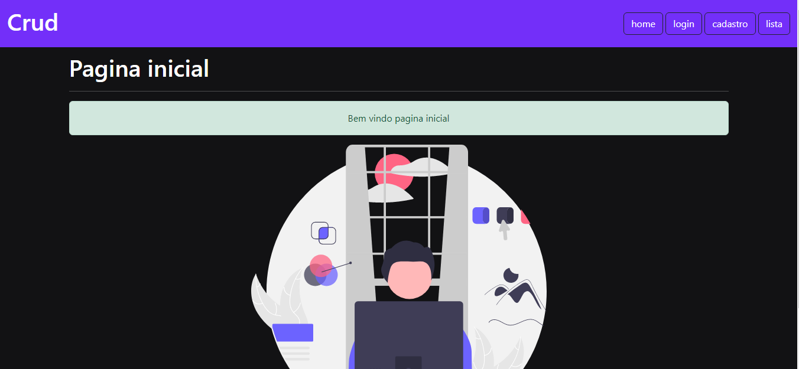
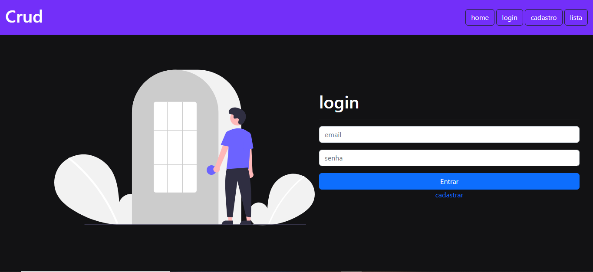
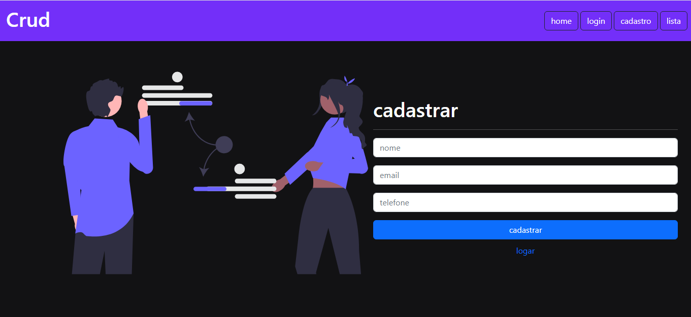
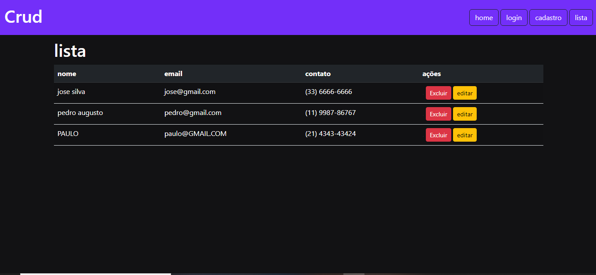

# beacademy-devstart-crud-contatos-php

Projeto criado em PHP , foi feito uma agenda de contatos onde você consegue cadastrar , editar ,excluir e visualizar os contatos.

## Funcionalidades

- Cadastro de contatos
- Edição de contatos
- Exclusão de contatos
- listar contatos

## Aprendizados

- Uso de Bootstrap v5.
- PHP

## Screenshots

- Tela de home
  
 

- Tela de login
  

- Tela de cadastro
  

- Tela de listagem
  
  
 ## Autor

  [@PabloHenrique🚀]()
